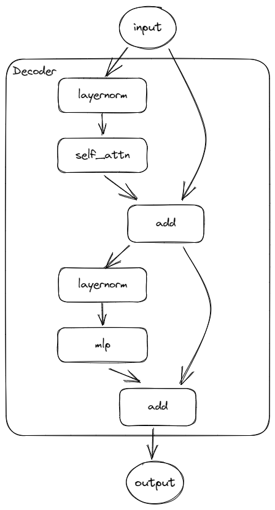
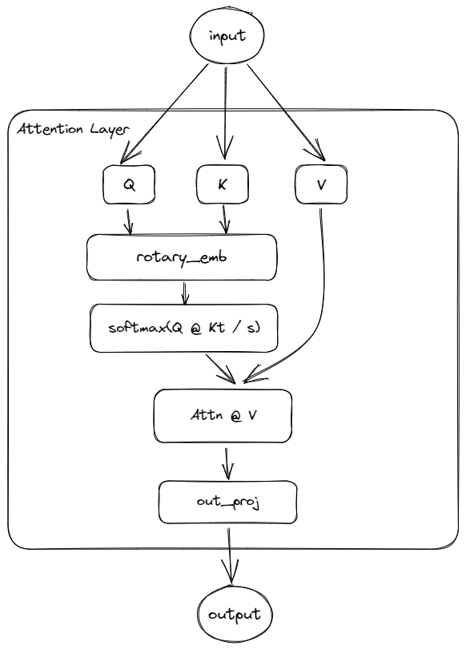
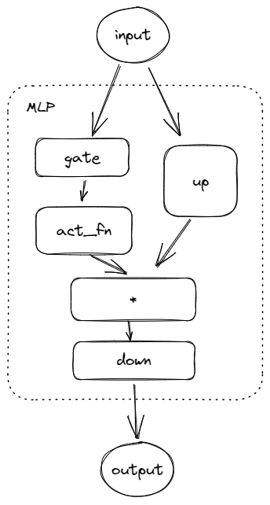

## Decode Layer

#### modules:
    self_attn
    mlp
    input_layernorm
    post_attention_layernorm

#### forward:
    input:              b, tokens, hidden_size
    residual:           b, tokens, hidden_size
        input_layernorm:    b, tokens, hidden_size
        attn_out:           b, tokens, hidden_size
    hidden_states = residual + attn_out
    reidual = hidden_states
        post_attention_layernorm:   b, tokens, hidden_size
        mlp:                        b, tokens, hidden_size
    hidden_states = residual + mlp

## Attention Layer

#### modules:(linear, cout X cin)
    q:      nh *        nd, hidden_size
    k:      nkv_heads * nd, hidden_size
    v:      nkv_heads * nd, hidden_size
    out:    nh *        nd, hidden_size

#### forward
    input:              # b, tokens, hidden_size
    query:  q(input)    # b, tokens, nh * nd          =>  b, tokens, nh,        nd => b, nh,        tokens, nd
    keys:   k(input)    # b, tokens, nkv_heads * nd   =>  b, tokens, nkv_heads, nd => b, nkv_heads, tokens, nd
    values: v(input)    # b, tokens, nkv_heads * nd   =>  b, tokens, nkv_heads, nd => b, nkv_heads, tokens, nd

    rotary_embbeding: querys, keys ## 位置编码
    repeat_kv:
        query / keys: b, nkv_heads, tokens, nd => b, nkv_heads * num_key_value_groups, tokens, nd => b, nh, tokens, nd ## nkv_heads * num_key_value_groups == nh

    attn_output: # torch.nn.functional.scaled_dot_product_attention
        (softmax(Q @ K.T / scale) @ V).T
        query:  b, nh, tokens, nd
        keys.T: b, nh, nd, tokens
        Q @ K.T => b, nh, tokens, tokens ## 每一维度，长tokens上的注意力分数
        softmax_value       => b, nh, tokens, tokens
        softmax_value @ V   => b, nh, tokens, nd
        @value.T            => b, tokens, nh, nd => b, tokens, nh * nd

    output_proj: b, tokens, hidden_size

## MLP

#### modules:(linear, cout X cin)
gate:   mi, hidden_size
up:     mi, hidden_size
down:   mi, hidden_size
act_fn

#### forward
    input:      b, tokens, hidden_size
    gate:       b, tokens, mi
    up:         b, tokens, mi
    gate * up:  b, tokens, mi
    down:       b, tokens, hidden_size

